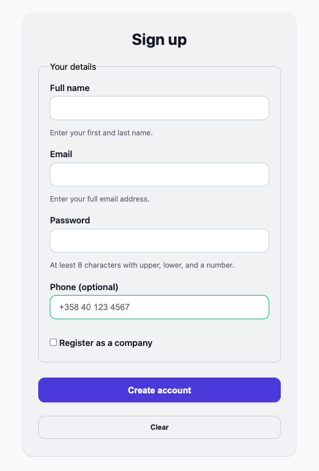
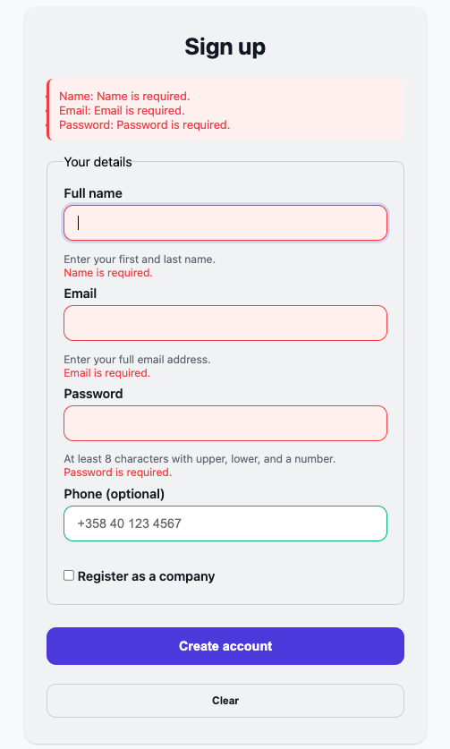

# Smart Forms Demo

A lightweight, accessible, and fully-featured signup form demo built with **HTML, CSS, and JavaScript**. This project demonstrates form validation, live error feedback, local storage persistence, conditional company registration, and honeypot spam protection.

| Front page without error                    | Error handling                               |
|-------------------------|-----------------------------------------------|
|            |         |


---

## Features

- **Client-side Validation**  
  - Full name, email, password, phone number, and optional company fields.  
  - Real-time validation feedback and error summary display.  

- **Local Storage Persistence**  
  - Draft form data automatically saved while typing.  
  - Submissions stored locally in `signup-submissions` key.  

- **Conditional Fields**  
  - Optional company registration section appears when the user selects a checkbox.  

- **Honeypot Spam Protection**  
  - Hidden field prevents automated bot submissions.  

- **Clear Form Functionality**  
  - Clears all inputs, error messages, draft data, and locally stored submissions.  

- **Accessible & Responsive**  
  - ARIA attributes and proper keyboard focus management.  
  - Fully responsive layout for desktop and mobile.  

---

## Project Structure

```bash
WS5-smart-forms/
├── assets/
│   └── style.css           # CSS styling for layout, inputs, and buttons
├── img/                # Contains image assets used in the application.
│   ├── ErrorMessage.png
│   └── FormPage.png
├── js/
│   └── app.js              # JavaScript for validation, localStorage, and submission
├── index.html              # Main HTML file containing the form
└── README.md               # Project documentation
```

---

## Usage

### 1. Open the Demo

Open `index.html` in any modern browser.

### 2. Fill Out the Form

- Enter your **full name**, **email**, and **password**.  
- Optionally provide a **phone number**.  
- Check **"Register as a company"** to reveal the company name field.  

### 3. Live Validation

- Errors appear in real-time as you type.  
- An **error summary** is displayed at the top of the form if there are invalid fields.  

### 4. Save Draft Automatically

- Form inputs are saved in localStorage automatically while typing.  
- Draft data persists even if the page is reloaded.  

### 5. Submit Form

- On submit, your data is stored locally in the `signup-submissions` key.  
- Successful submissions display a confirmation alert.  
- Draft data is optionally cleared after submission.  

### 6. Clear Form

- Click **Clear** to reset the form.  
- All localStorage data including drafts and submissions will be removed.  

---

## Local Storage Keys

| Key                     | Description                                   |
|-------------------------|-----------------------------------------------|
| `signup-draft`           | Temporarily saves the form while typing      |
| `signup-submissions`     | Stores all submitted form data locally       |

---

## Live Preview / Demo Instructions

You can inspect and interact with saved submissions using your browser's **DevTools > Console**.

### 1. Inspect Draft Data
```javascript
JSON.parse(localStorage.getItem('signup-draft'));
```

### 2. Inspect All Submissions
```javascript
JSON.parse(localStorage.getItem('signup-submissions'));
```

### 3. Clear Local Storage Manually
```javascript
localStorage.removeItem('signup-draft');
localStorage.removeItem('signup-submissions');
```

### 4. Verify Persistence
- Refresh the page after submitting the form to see that draft and submission data are retained until cleared.

---

## Browser Compatibility

Tested on modern browsers including:

- Google Chrome  
- Mozilla Firefox  
- Microsoft Edge  
- Safari  

---
